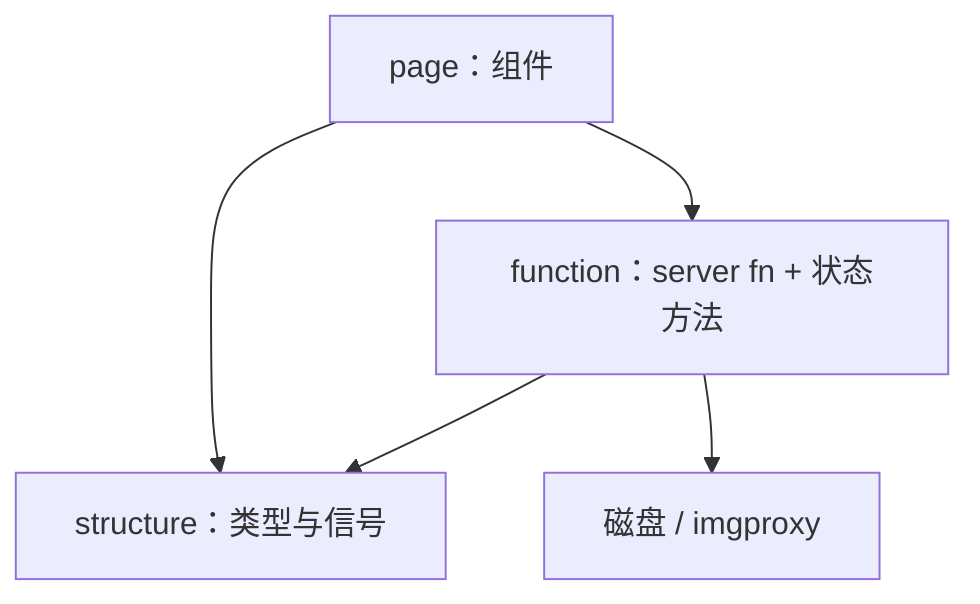

# 代码结构

源码根是 [`src/`](../src/)。库 crate（`cdylib` + `rlib`）给 WASM hydrate；二进制 crate 在 SSR feature 下跑 Axum。布局按职责分成三层，而不是按「页面路由」再切一遍（应用只有 `/`）。

## 仓库顶层

```
pic-viewer/
  src/                 应用代码
  style/main.css       唯一样式入口（cargo-leptos style-file）
  public/              静态资源目录（现可为空）
  example.env          Compose 环境变量模板（复制为 .env）
  docker-compose.yml   生产
  dev.docker-compose.yml
  Dockerfile / Dockerfile.dev
  k8s/deployment.yaml
  Cargo.toml           依赖、feature、leptos metadata
  rust-toolchain.toml  stable + wasm32-unknown-unknown
  readme/              本目录文档
```

`.gitignore` 忽略 `target/`、`.dev-cache/`、`.env`、`test/`、以及 `pics/` 下除占位外的内容。`example.env` 要提交；本地 `.env` 不要提交。

## Cargo feature

| feature | 用途 |
| --- | --- |
| `ssr` | 二进制：Axum、tokio、rusqlite、image、zip、reqwest、little_exif 等 |
| `hydrate` | WASM：wasm-bindgen、web-sys、gloo-timers |

`[package.metadata.leptos]`：`bin-features = ["ssr"]`，`lib-features = ["hydrate"]`。server function 的函数签名两端都编译，函数体只在 ssr 里真正执行。

入口：

- [`src/lib.rs`](../src/lib.rs)：`function` / `page` / `structure`；hydrate 时 `hydrate_body(App)`。
- [`src/main.rs`](../src/main.rs)：仅 `ssr` 绑定路由（见 [部署 · HTTP 路由](部署.md#http-路由对外)）。非 ssr 的 `main` 为空。

## 三层含义

| 目录 | 职责 | 可否调 UI |
| --- | --- | --- |
| `structure/` | 纯数据与 `ExplorerState` 信号字段 | 否 |
| `function/` | 路径工具、server function、SSR 文件 / 媒体 / EXIF | 不渲染视图；`function/explorer.rs` 给 `ExplorerState` 写行为方法 |
| `page/` | Leptos 组件 | 通过 Context 读状态，调 `function` |

不要让 `structure` 依赖 `function`（避免模块环）。`FsEntry::image_from_path`、`SelectedItem::from_image_path` 在 structure 内自己取文件名。



## `src/page/` 界面

| 路径 | 内容 |
| --- | --- |
| `app.rs` | `shell`（HTML 骨架）、`App`（样式、Title、唯一 `Route ""` → Explorer） |
| `explorer/mod.rs` | 顶栏、工作区拼装、底栏、面板开关 |
| `explorer/dialogs.rs` | 删除 / 重命名 / 新建目录 / 新建文件 / 失败列表 |
| `file_tree.rs` | 左侧工具条与目录树 |
| `image_viewer/mod.rs` | 预览舞台、缩放旋转、原图 / 子目录、切图 |
| `image_viewer/filmstrip.rs` | 胶片条分页与 Thumb |
| `image_viewer/filter_bar.rs` | 筛选 UI 与索引轮询 |
| `image_viewer/mark_bar.rs` | 星标、tag、批量标记 |
| `image_viewer/export_bar.rs` | 导出 UI |
| `text_editor.rs` | 文本编辑与界面设置 |
| `copy_text.rs` | 剪贴板写入（WASM `navigator.clipboard`） |

`ImageViewer` 拆成子模块是因为单文件过长，不是多路由。

## `src/structure/` 数据

| 路径 | 内容 |
| --- | --- |
| `fs.rs` | `FsEntry`、`ImageList`、`IMAGE_EXTS` |
| `explorer.rs` | `SelectedItem`、`CheckedList`、`Clipboard*`、`Failure*`、`ExplorerState` 字段与面板/展开辅助 |

`SelectedItem` / `FsEntry` / `ClipboardItem` 用 `From` 转换。`CheckedList` 用 `Vec` 保序 + `HashSet` 查重。

`ExplorerState` 是 `Copy` 的信号句柄包，不拆多个 Context（各栏都要同一份 selected / checked / refresh）。

状态上的**命令**（复制粘贴、确认删除等）在 `function/explorer.rs` 的 `impl ExplorerState`，与字段定义分开，避免 `structure` 调 server function。

## `src/function/` 服务端与共享逻辑

| 路径 | 内容 |
| --- | --- |
| `path.rs` | `rel_name`、`parent_path`、`join_rel`、`validate_file_name`、`rewrite_prefix`、媒体 URL |
| `sniff.rs` | `FileKind`、文件头 / 扩展名分类、`decode_text`；ssr 下 `classify_file` / `sniff_file` |
| `fs/mod.rs` | 再导出 list / ops / text；ssr 再导出 sandbox / media |
| `fs/sandbox.rs` | `pic_root`、`resolve_path`、`unique_dest`、`copy_recursively`、`mime_for`（仅 ssr） |
| `fs/list.rs` | `list_dir`、`list_images`、扫描与 `(dir, recursive, epoch)` 缓存 |
| `fs/ops.rs` | 删、改名、建目录 / 文件、粘贴 |
| `fs/text.rs` | 读 / 写文本及大小限制 |
| `fs/media.rs` | Range 原图流、imgproxy 转发（仅 ssr） |
| `explorer.rs` | 勾选、剪贴板、粘贴后路径改写、对话框确认逻辑 |
| `rating.rs` | 单张 / 批量 EXIF 星标与 tag |
| `filter.rs` | 内存 SQLite 元数据索引、筛选、索引进度 |
| `export.rs` | 转码或原图、zip、`/export/{id}` |
| `rotate.rs` | 旋转像素并尽量保留 EXIF |

`function/mod.rs` 把常用 server function 和 ssr 专用符号 `pub use` 出去，页面侧 `use crate::function::{list_images, thumb_url, ...}` 即可。

## 扫描与分类要点（实现约束）

- `list_dir`：`spawn_blocking`，点文件跳过，目录优先 + 名不区分大小写排序。
- `collect_image_scan`：只收集 `FileKind::Image`；递归不 follow symlink；`MAX_GALLERY_IMAGES = 10_000`。
- `classify_file`：扩展名能判定则不再读盘；否则读最多 64 字节。
- 元数据索引与 `list_images` 共用 `cached_image_scan`，避免筛选时再走一遍树。

## 测试位置

单元测试写在模块内 `#[cfg(test)]`：

- `function/path.rs`：`rewrite_prefix`、路径拼接、文件名校验
- `function/sniff.rs`：魔数与文本判断
- `function/filter.rs`：tag 合并与星标比较

运行：`cargo test --lib --features ssr`。

## 改代码时的习惯位置

| 想改的东西 | 先打开 |
| --- | --- |
| 顶栏开关、对话框文案 | `page/explorer/` |
| 树操作按钮 | `page/file_tree.rs` + `function/explorer.rs` |
| 预览快捷键式交互 | `page/image_viewer/mod.rs` |
| 胶片分页 | `page/image_viewer/filmstrip.rs` |
| 沙箱 / 越界 | `function/fs/sandbox.rs` |
| 缩略图尺寸 | `function/fs/media.rs` 里 `THUMB_PROCESSING` / `PREVIEW_PROCESSING` |
| 新的「这是不是图片」规则 | `function/sniff.rs` |
| 状态里新加一个全局开关 | `structure/explorer.rs` 的 `ExplorerState::new` |
