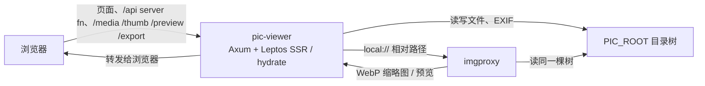
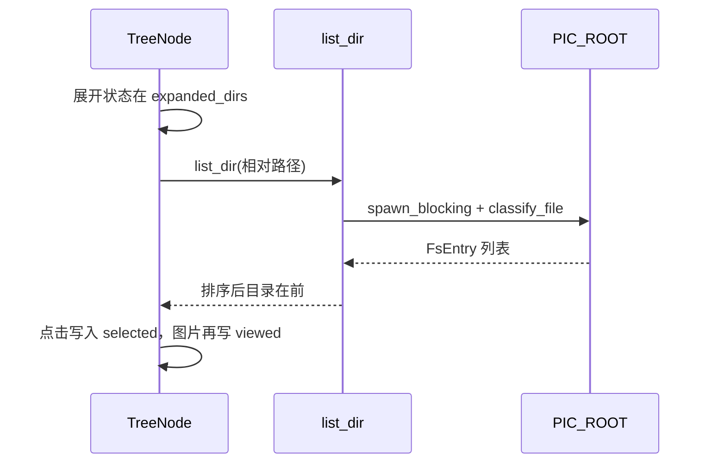
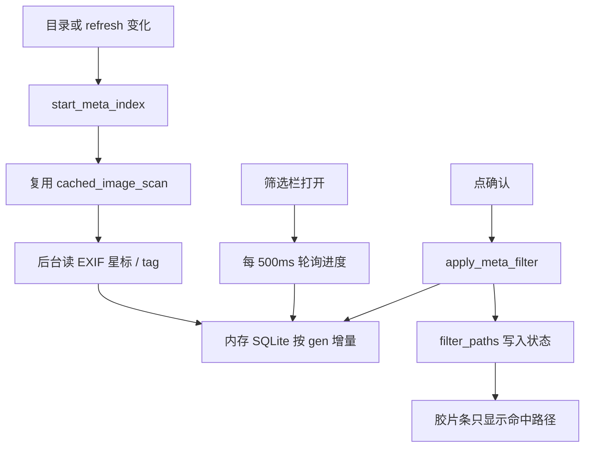

# 流程结构

本文说明运行时数据怎么走，不逐文件讲解代码（见 [代码结构](代码结构.md)）。界面能力见 [模块功能](模块功能.md)。

## 总体形态

浏览器只连应用。图片像素有三条路：

| 前端 URL | 服务端 | 使用场景 |
| --- | --- | --- |
| `/thumb/{rel}` | imgproxy fill 184×128，或回退原图 | 胶片条 |
| `/preview/{rel}` | imgproxy fit 1920，或回退原图 | 主预览（未勾「原图」） |
| `/media/{rel}` | 本地文件流，支持 Range | 勾选「原图」 |

`rel` 为相对 `PIC_ROOT` 的路径。查询串 `?v={media_rev}` 在旋转写回后刷新缓存。

## 启动与页面加载

1. 二进制读取 `PIC_ROOT`（缺省 `./pics`，不存在则创建）、可选 `IMGPROXY_URL`、Leptos 站点配置。
2. Axum 挂上 `/health`、媒体路由、`/export/{id}` 和 Leptos 路由；静态资源走 `LEPTOS_SITE_ROOT`。
3. 浏览器拿到 HTML + `/pkg/pic-viewer.js` / `.wasm` / `.css`，hydrate 到 `App` → 唯一路由 `/` → `Explorer`。
4. `Explorer` 创建一份 `ExplorerState` 并 `provide_context`。子组件全部 `expect_context`，不再拆第二份全局状态。

## 图片模式 vs 文本模式

`ExplorerState::is_text_mode()`：当前选中项 `is_text == true`。

- 顶栏在「图片 |」与「文本 |」两组开关之间切换。
- `ImageViewer` **始终挂载**，文本模式加 `panel-off`，避免切文件时拆掉预览导致「原图」勾选丢失。
- `TextEditor` 仅在文本模式 `Show`。

文件种类来自服务端 `classify_file`：先看扩展名快路径，未知再读文件头最多 64 字节（`sniff`）。树节点据此显示图标，并决定点击后是 `viewed`（图片）还是文本编辑。

视频会被分类为 Video，当前没有播放器，只当普通文件。

## 文件树

- 根路径是空字符串，显示为 `/`。
- `refresh` 递增会让已展开节点的 `Resource` 重拉，但 `expanded_dirs` 保留，粘贴后目录不会被收起。
- 「当前项 · 刷新」只加 `refresh`；「已选 · 刷新」先清空勾选再刷新。

## 胶片条与切图

`ImageViewer` 用 `gallery_dir`（当前图的父目录，或选中的目录）+ `refresh` +「包括子目录」去调 `list_images`。

服务端 `cached_image_scan` 按 `(dir, recursive, epoch)` 缓存一次扫描。递归顺序：当前目录图片按名排序，再 DFS 子目录。跳过点文件。超过约 10000 张截断并在状态栏提示。

前端：

1. 可选 `filter_paths`（筛选结果）再过滤路径。
2. 胶片条每页 100 张，芯片显示 `当前页/总页`。
3. 缩略图 `loading="lazy"`。
4. 主图左右 10% 点击、工具栏 ‹ › 在**完整过滤列表**上移动，并自动翻到对应胶片页。
5. 切图时同步 `viewed` 与 `selected`（图片项）。

## 预览交互

- 滚轮缩放，拖拽平移，90° 旋转（仅变换，点「保存」才写文件）。
- 「保存」调用 `save_rotated_image`，成功后 `media_rev += 1`。
- 「原图」只改 `` 用 `/media` 还是 `/preview`，组件不卸载。
- 勾选框在预览右下角；点击预览边缘切图的热区 z-index 低于勾选框。

## 标记、索引、筛选

- 星标 / tag 写在文件 EXIF 里（Rating、描述 / UserComment 等），不是独立数据库文件。
- 索引在进程内 SQLite（内存）。换目录或 `refresh` 会 bump `gen`，按 mtime+size 尽量增量。
- 筛选面板关闭时不轮询。tag 输入防抖 400 ms 写回。
- 「批量标记」：当前星标覆盖勾选图，当前 tag **追加**且去重。

## 导出

1. 收集勾选中的图片路径。
2. `export_checked(paths, dest, dest_dir, format)`。
   - `dest=download`：单张直接下，多张打 zip；临时文件约 15 分钟清理。
   - `dest=dir` 且来自「当前目录」或「特定目录」：写入 `PIC_ROOT` 下目标，重名加 `(1)`。
3. 格式 `original` 拷贝原文件；其余用 `image` crate 转码，并尽量带上 EXIF。
4. 下载通过返回的 `/export/{id}` 触发（WASM 里改 `location.href`）。

## 文本编辑

选中嗅探为文本的文件 → 文本模式 → `read_text_file`（>2 MB 拒绝；头 64 字节必须是 Text）→ 编辑 → `write_text_file`（内容 >8 MB 拒绝；已存在则再 sniff 必须为文本）。UTF-8 / UTF-16 BOM 由 `decode_text` 处理。

## 状态字段（运行时中枢）

`ExplorerState` 一份 Context，主要信号：

| 信号 | 作用 |
| --- | --- |
| `selected` | 当前项（树 / 胶片 / 切图） |
| `viewed` | 正在预览的图片路径 |
| `checked` | 勾选列表（Vec + HashSet） |
| `clipboard` | 复制或剪切 |
| `refresh` | 使列表 Resource 重跑 |
| `media_rev` | 使 img URL 失效 |
| `expanded_dirs` | 树展开 |
| `filter_paths` | `Some` 时胶片条只显示集合内路径 |
| `show_*` | 各面板开关 |
| 对话框草稿 | 删除确认、重命名、新建目录 / 文件、失败列表 |

文件操作（粘贴、重命名、删除）在 `function/explorer.rs` 的 `impl ExplorerState` 中调 server function，并用 `rewrite_prefix` 改写勾选 / 剪贴板 / 展开路径。
